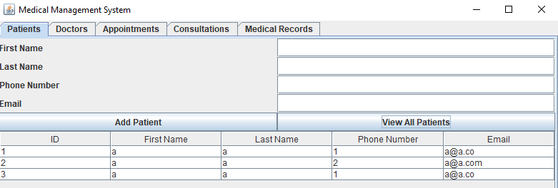
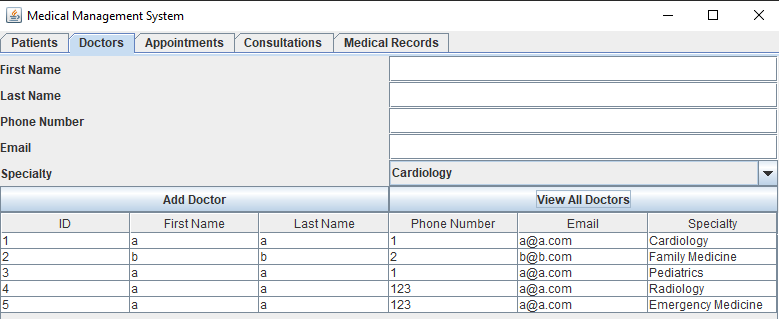

# Medical Office Management System
hope this image works  :

Patients Example :

Doctors Example :

## Overview
This is a Java-based medical office management system that allows for the organization and automation of a medical office, managing medical records, appointments, and patient files.

## Features
- Manage and track medical records
- Schedule and manage appointments
- Manage patient information
- User authentication (coming soon)
- Reporting and analytics (coming soon)

## Requirements
- Java Development Kit (JDK) 8 or higher
- Eclipse IDE
- SQLite

## Setup Instructions

1. **Clone the Repository (paste these in cmd) :**
   
   git clone https://github.com/mMohamedLaid/medicalproject.git
   
   cd medicalproject              (this is to know where medicalproject is )
